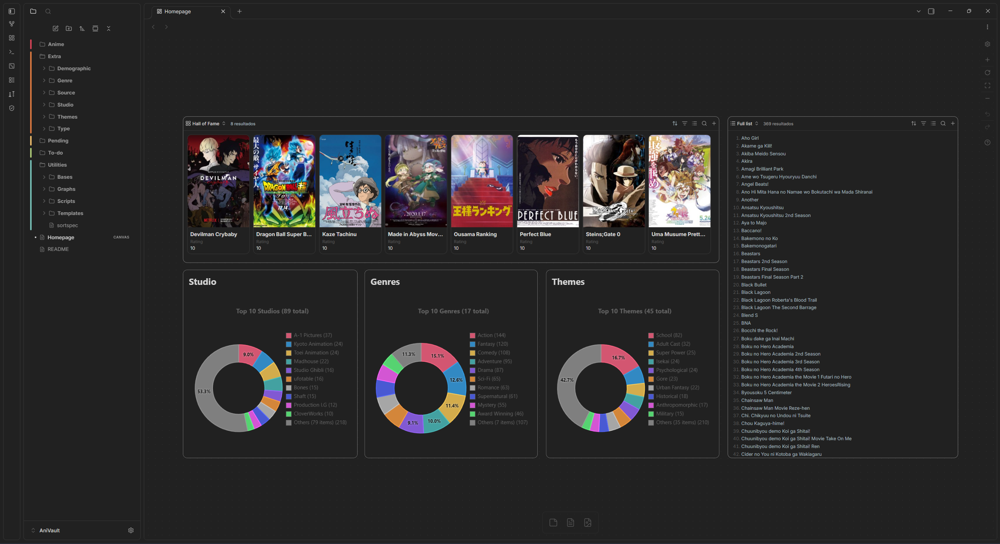
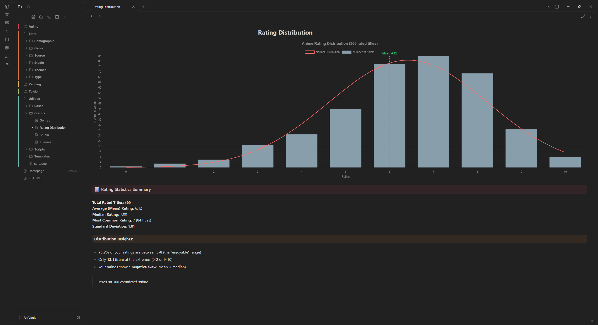

# AniVault

> Anime collection tracker & reference database powered by Obsidian

[](https://github.com/AnxoSilvaSixto/AniVault)

> **Personal vault** — fork, use, modify freely. Public domain, no restrictions.

## 📑 Contents

- [Overview](#-overview)
- [Collection Stats](#-collection-stats)
- [Quick Start](#-quick-start)
- [Structure](#️-structure)
- [Preview](#️-preview)
- [Frontmatter Schema](#-frontmatter-schema)
- [Views](#️-views)
- [Automation](#-automation)

## 🌸 Overview

AniVault is a local-first Obsidian vault for tracking watched anime. Every entry is a Markdown note with MAL-sourced frontmatter, linked to studios, genres, themes, and more. Query with Bases/Dataview, visualize with Charts — offline, plain Markdown, no lock-in. Full guidelines: `.obsidian/AGENTS.md`.

## 📊 Collection Stats

> Snapshot as of `2026-10-02`. Live counts: open `Utilities/Bases/Anime tracker.base` or run `vault-inspector`.

| Category | Count | Notes |
|----------|-------|-------|
| **Anime Notes** | **371** | standalone + 57 series subfolders in `Anime/` |
| **Reference Pages** | **185** | `Extra/` total |
| — Studios | 92 | `Extra/Studio/` |
| — Themes | 52 | `Extra/Themes/` |
| — Genres | 21 | `Extra/Genre/` |
| — Sources | 10 | `Extra/Source/` |
| — Demographics | 5 | `Extra/Demographic/` |
| — Types | 5 | `Extra/Type/` |
| **Watchlist** | **19** | `Pending/` (intentionally incomplete) |
| **Bases** | 7 | `Utilities/Bases/` |
| **Graphs** | 4 | `Utilities/Graphs/` |

## 🚀 Quick Start

Needs Obsidian ≥ `1.13.4`, Git, [Baseline theme](https://github.com/aaaaalexis/baseline) + 6 plugins (`dataview`, `obsidian-charts`, `pretty-properties`, `obsidian-style-settings`, `custom-sort`, `vault-inspector`).

**1. Clone:** `git clone https://github.com/AnxoSilvaSixto/AniVault.git` → open folder as vault, trust it. Homepage is `Homepage.canvas`.

**2. Enable:** `Settings → Community plugins → Enable` all 6 above. Then `Appearance → CSS snippets → Enable` `media-grid`, `obsidian-icons`, `text-centered`.

**3. Verify:** open `Utilities/Bases/Anime tracker.base` and `Homepage.canvas` — you should see 371 entries and 3 charts. Run `python Utilities/Scripts/validate_vault.py`.

## 🏗️ Structure

```
AniVault/
├── Anime/                 # 371 notes — flat files + 57 series folders
├── Extra/                 # 185 reference pages
│   ├── Demographic/       # 5
│   ├── Genre/             # 21
│   ├── Source/            # 10
│   ├── Studio/            # 92
│   ├── Themes/            # 52
│   └── Type/              # 5
├── Pending/               # 19 watchlist stubs — intentionally incomplete
├── Utilities/
│   ├── Bases/             # 7 .base views (tracker + dimensions)
│   ├── Graphs/            # 4 DataviewJS chart notes
│   ├── Scripts/           # update_readme.py, validate_vault.py, sync helpers
│   ├── Templates/         # media-grid Template.md (needs media-grid.css)
│   └── sortspec.md        # Custom Sort spec (folders+files A→Z)
├── Homepage.canvas        # Dashboard — embeds 3 graphs + 2 tracker views
└── .obsidian/             # config + hidden AGENTS.md
```

`To-do/` and `Utilities/` are hidden from search/graph (`userIgnoreFilters`) but tracked. `workspace.json` and `vault-inspector/data.json` are ignored.

## 🖼️ Preview




`Homepage.canvas` + `Rating Distribution.md` (366 rated, mean 6.42). Baseline theme.

## 📝 Frontmatter Schema

Watched `Anime/*.md` only. `Pending/` is intentionally incomplete. Lists are wikilink arrays. `Rating` is yours (0 = unrated). Full spec: `.obsidian/AGENTS.md`.

```yaml
---
ID: 30654
Type: "[[TV]]"
Episodes: 25
Studio:
  - "[[Lerche]]"
Source: "[[Manga]]"
Genre:
  - "[[Action]]"
Rating: 8
Prequels:
  - "[[Ansatsu Kyoushitsu]]"
---
```

| Field | Type | Notes |
|-------|------|-------|
| `ID` / `MAL` | int / url | MAL ID + URL must match |
| `Type` / `Source` | `[[..]]` | From `Extra/Type/`, `Extra/Source/` |
| `Studio` / `Genre` / `Themes` | `[[..]][]` | Arrays, may be empty |
| `Rating` | 0–10 | Personal; `0` unrated, never overwritten |
| `Prequels` / `Sequels` | `[[Anime]][]` | Manual relations, media-grid rendered |

Example: `Anime/Ansatsu Kyoushitsu/Ansatsu Kyoushitsu 2nd Season.md`.

## 🗃️ Views

Bases (`Utilities/Bases/`, no Dataview needed): `Anime tracker.base` is the main table — filter/sort all 371 entries (`Full list`, `Hall of Fame`, `Top`, `Searcher`). Six dimension bases mirror `Extra/` folders.

Graphs (`Utilities/Graphs/`, DataviewJS + Charts): `Genres.md`, `Themes.md`, `Studio.md` (doughnuts) + `Rating Distribution.md` (bar+curve). All query `dv.pages('"Anime"')` — never `'"Anime/"'`. First three are embedded in `Homepage.canvas`.

## 🔄 Automation

Validator: `python Utilities/Scripts/validate_vault.py` — read-only check for frontmatter, IDs, links, media-grid targets, encoding, README counts. `Rating: 0` stays unrated.

Backup: weekly Windows login via `Task Scheduler → AniVault Git Backup` → `C:\Scripts\AniVault-backup.ps1` (runs `update_readme.py`, then `git add/commit/push`). Hook: `git config core.hooksPath .githooks` (blocks secrets + >10 MB).

Stats are auto-maintained: run `python Utilities/Scripts/update_readme.py` before committing. Never hand-edit counts. Sync scripts (`sync_anime.py`, `sync_studios.py`) are helpers — documented in AGENTS only. Tips: new anime → `Anime/<Series>/<Title>.md` from template; watchlist stays in `Pending/`; don't create `Extra/Studio/` pages without a watched link. Docs: `.obsidian/AGENTS.md`. License: public domain, no rights reserved.

---

*Last updated: 2026-10-02 · Vault: 371 anime · 185 refs · 19 pending*
